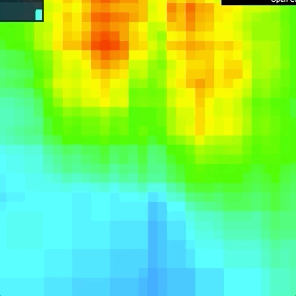
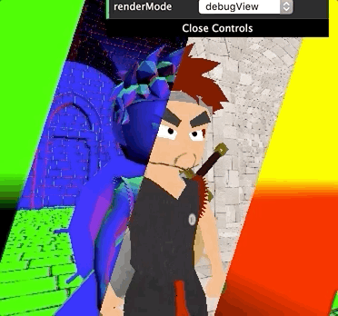
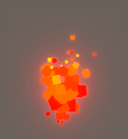

# WebGPU Deferred Renderer







## To CIS 565 TA

### Run locally

```
/Applications/Google\ Chrome\ Canary.app/Contents/MacOS/Google\ Chrome\ Canary  --enable-unsafe-webgpu "http://localhost:8080"
```

### Status

This is now a basic working implementation of deferred renderer using WebGPU API, with a tile-based light culling implementation powered by compute shader.

I'm still doing cleaning, refactoring, fixing, etc. on the fly.

I have it working on Mac 10.14.6 AMD, Chrome Canary (79.0.3941.0 (Official Build) canary (64-bit))

Since both WebGPU API spec and Chrome implementation could change and break things. It might be better to ask students turn off auto update after they have one with WebGPU working (WebGPU Samples running).

### Learning resource

Unfortunately at this point there aren't many articles/docs for WebGPU. I basically reference the following materials when I do the implementation:

* [WebGPU Samples]()
    * Should give you some basic scenarios of using WebGPU. I believe it's not fully covered at this point. Good source to learn, mimic, and copy/paste. (though it's in typescript)
* [WebGPU spec](https://gpuweb.github.io/gpuweb/)
    * Very helpful when you have questions for certain parameters of a descriptor.
* [Get started with GPU Compute on the Web](https://developers.google.com/web/updates/2019/08/get-started-with-gpu-compute-on-the-web)
    * Helpful for buffer mapped and compute shader setup.

### Notes

At this point (Oct-11-2019)

* Sampling from depth texture is not supported. Might be an obstacle for students want to some early-z optimization, cluster shading. (though could still be done using compute shader or write gl_Position.z to color buffer etc.)
* Layered rendering is not supported. So seems like you could not use an array texture in shader and 2d texture array. This might make optimizing number and structure of GBuffer a bit more painful. You could write some helper functions like iterate through each gbuffer and injecting shader texts to make it better.
* Texture support is pretty early at this point (as you may have already noticed in `createTextureFromImage`). Also there's no `gl.generateMipmap` counterpart now. You might be able to write a helper function, or have prebuilt mipmap levels as separate image files.
* I use native javascript module support in browser. You might want to introduce libs like Babel/webpack or not. There are goods and bads.

### Project task ideas

Some of my personal thoughts:

* Tiled deferred (could use compute shader)
* More gbuffer component, for example metallic, roughness to make a physically based renderer.
* Making a glowing particle system (like a low-poly style flame) to make the most of deferred shading and compute shader in WebGPU to make the scene looks nicer. (instead of some ghosty pure perf oriented lights)
    * 
* Some perf comparison compared to old WebGL deferred shader.

